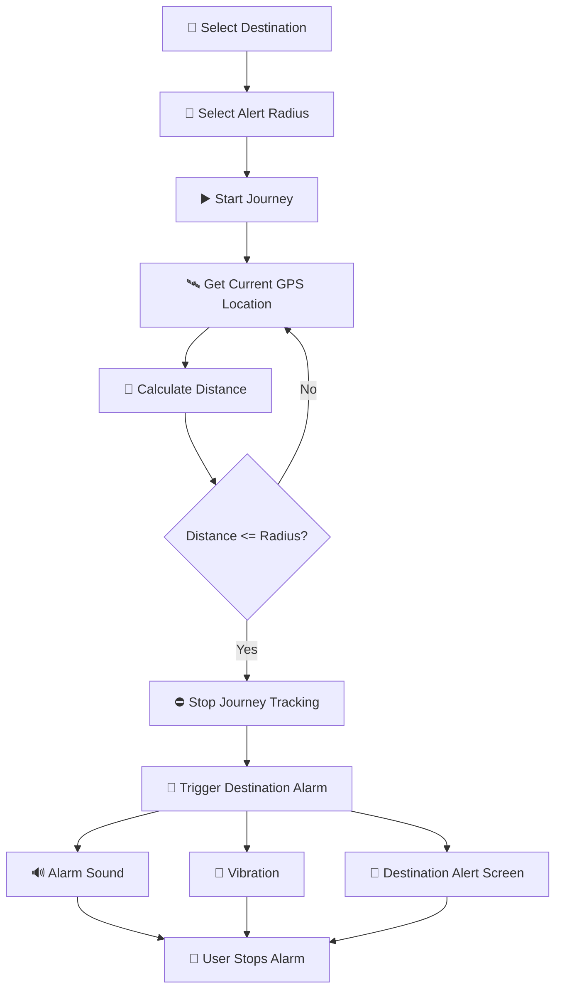
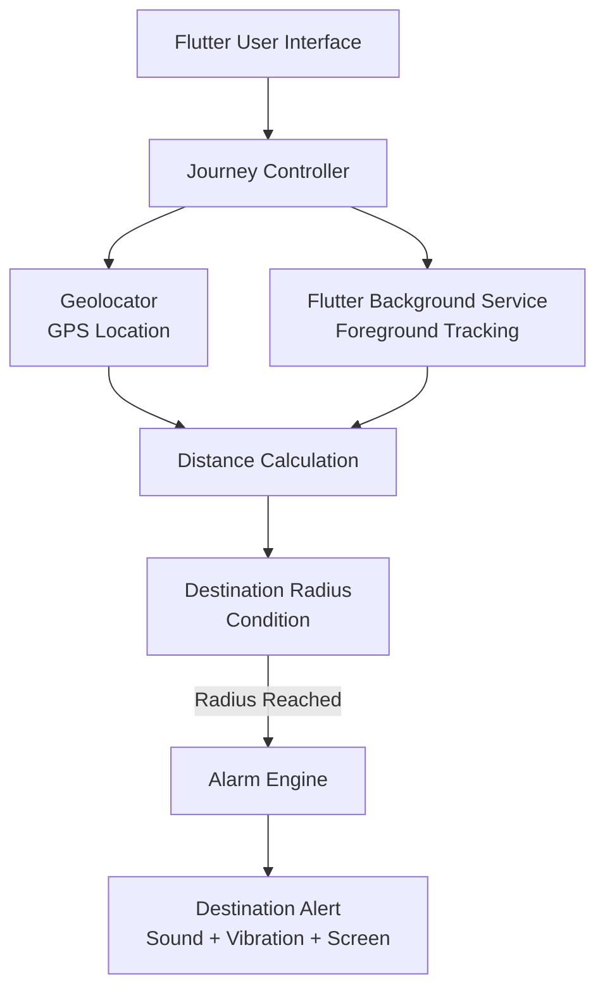

# 🚨 Destination Alarm

<p align="center">
  
</p>

<h1 align="center">Destination Alarm</h1>

<p align="center">
  <strong>Never Miss Your Destination Again.</strong>
</p>

<p align="center">
  A smart Android location-based alarm application designed for commuters,
  travelers, and passengers who want to be alerted when they approach their destination.
</p>

<p align="center">
  <a href="https://github.com/bhimratna/destination-alarm/releases/latest">
    
  </a>
  <a href="https://github.com/bhimratna/destination-alarm/stargazers">
    
  </a>
  <a href="https://github.com/bhimratna/destination-alarm/issues">
    
  </a>
  
  
  
</p>

---

## 📱 Overview

**Destination Alarm** is an Android application designed to help commuters
avoid missing their destination during long journeys.

The user selects a destination and configures a destination alert radius.
During an active journey, the application monitors the device's GPS location
and calculates the distance between the current location and the destination.

When the user enters the configured destination radius, the application
automatically triggers a loud alarm with vibration and displays a dedicated
destination-alert interface.

### Example

A passenger may travel **38 km** by bus while setting a **1 km destination
alert radius**.

The **38 km** is the journey distance.

The **1 km** is the distance at which the alarm should be triggered.

---

# 🎯 Problem Statement

Long-distance commuters can miss their destination because they may:

- Fall asleep during the journey
- Become distracted
- Stop checking their phone
- Travel during night hours
- Be unfamiliar with the route

Traditional navigation applications are primarily designed for navigation
and route guidance.

Destination Alarm focuses on a different requirement:

> **Automatically alert the passenger when they enter a predefined area around
> their destination.**

---

# 💡 Proposed Solution

Destination Alarm converts a smartphone into a **location-based destination
alarm system**.

The system continuously evaluates the user's location during an active
journey.

```text
Destination
     ↓
Alert Radius
     ↓
Start Journey
     ↓
GPS Location Tracking
     ↓
Distance Calculation
     ↓
Distance <= Alert Radius ?
     ↓
   YES
     ↓
Stop Tracking
     ↓
Trigger Alarm
     ↓
Sound + Vibration + Alert Screen
```

---

# ✨ Key Features

### 📍 Destination-Based Alert

Users can configure a destination alert radius according to their journey.

Example radius values:

- 500 m
- 1 km
- 2 km
- 3 km
- 5 km

---

### 🛰️ Live GPS Tracking

The application uses the device's location services to determine the user's
current geographical position.

The current location is continuously compared with the selected destination.

---

### 📏 Distance-Based Trigger

The alarm condition is based on the relationship between the current distance
and the selected destination radius.

```text
Current Distance <= Selected Radius
```

Example:

```text
Current Distance = 850 m
Selected Radius  = 1 km

850 m <= 1 km

→ Destination Alarm Triggered
```

---

### 🔔 Loud Alarm

When the destination condition is satisfied, the application can trigger:

- Alarm sound
- Vibration
- Destination notification
- Full-screen alarm interface

The user can manually stop the alarm.

---

### 🌙 Background Journey Monitoring

The application uses Android foreground-service functionality for journey
monitoring.

This allows the tracking service to continue while the application is not
actively visible.

Typical situations include:

- Screen locked
- Another application open
- Phone in pocket
- User resting during the journey

---

### 📱 Lock-Screen Alert

The alarm interface is configured to bring the destination alert to the
user's attention when the device is locked.

---

### 🎨 Modern Mobile Interface

Destination Alarm uses a dark user interface with a premium green accent.

The interface provides clear information about:

- Destination
- Current distance
- Selected radius
- Journey state
- GPS state
- Alarm state

---

# 🧠 How The System Works

The application follows a simple location-monitoring workflow:



---

# 🏗️ System Architecture



---

# 🧮 Distance Calculation

Each GPS location contains geographical coordinates:

```text
Latitude
Longitude
```

The application compares:

```text
Current Location
       ↓
Destination Location
```

The resulting geographical distance is used to determine whether the
destination alert radius has been reached.

Conceptually:

```text
Distance = Distance(Current Location, Destination)
```

The trigger condition is:

```dart
if (distance <= selectedRadius) {
  triggerAlarm();
}
```

This makes the system **distance-based rather than time-based**.

---

# 🛠️ Technology Stack

## 📱 Application

| Technology | Purpose |
|---|---|
| Flutter | Mobile application framework |
| Dart | Application programming language |
| Material UI | Android user interface |

## 🛰️ Location & Background Processing

| Technology | Purpose |
|---|---|
| Geolocator | GPS location access and distance calculation |
| Flutter Background Service | Background/foreground journey monitoring |
| Android Foreground Service | Persistent background execution |

## 🔔 Alarm System

| Technology | Purpose |
|---|---|
| Alarm | Alarm scheduling and ringing |
| Android Notifications | Destination notification |
| Full-Screen Intent | Full-screen alarm alert |
| Wake Lock | Device wake support |
| Vibration | Audible/physical destination alert |

## 🔧 Development Tools

| Tool | Purpose |
|---|---|
| Visual Studio Code | Development environment |
| Flutter SDK | Application development and build |
| Android SDK | Android development |
| Gradle | Android build system |
| Git | Version control |
| GitHub | Source code hosting and releases |

---

# 📦 Flutter Packages

The project uses the following primary packages:

```yaml
dependencies:
  flutter:
    sdk: flutter

  geolocator:
  flutter_background_service:
  alarm:
  http:
```

The exact package versions used by the project are defined in:

```text
pubspec.yaml
pubspec.lock
```

---

# 📂 Project Structure

```text
destination_alarm/
│
├── android/
│   ├── app/
│   │   └── src/
│   │       └── main/
│   │           ├── AndroidManifest.xml
│   │           ├── kotlin/
│   │           │   └── com/example/destination_alarm/
│   │           │       └── MainActivity.kt
│   │           └── res/
│   │
│   ├── build.gradle.kts
│   ├── gradle.properties
│   └── settings.gradle.kts
│
├── assets/
│   └── icon/
│       └── app_icon.png
│
├── lib/
│   ├── main.dart
│   ├── alarm_screen.dart
│   └── alarm_test.dart
│
├── test/
│
├── pubspec.yaml
├── pubspec.lock
├── analysis_options.yaml
├── .gitignore
└── README.md
```

---

# 🔐 Android Permissions

The application requires Android permissions related to location,
background execution, notifications and alarm behavior.

### Location

```text
ACCESS_FINE_LOCATION
ACCESS_COARSE_LOCATION
ACCESS_BACKGROUND_LOCATION
```

### Background Service

```text
FOREGROUND_SERVICE
FOREGROUND_SERVICE_LOCATION
```

### Notifications

```text
POST_NOTIFICATIONS
```

### Alarm & Device Interaction

```text
WAKE_LOCK
VIBRATE
USE_FULL_SCREEN_INTENT
USE_EXACT_ALARM
SCHEDULE_EXACT_ALARM
```

These permissions support the application's location monitoring and
destination-alert functionality.

---

# 🚀 Getting Started

## Prerequisites

Install the following before running the project:

- Flutter SDK
- Dart SDK
- Android SDK
- Android Studio or Android SDK command-line tools
- Android device or Android emulator

Verify the Flutter environment:

```bash
flutter doctor
```

---

# 📥 Installation

### 1. Clone the Repository

```bash
git clone https://github.com/bhimratna/destination-alarm.git
```

### 2. Open the Project

```bash
cd destination-alarm
```

### 3. Install Dependencies

```bash
flutter pub get
```

### 4. Check Connected Devices

```bash
flutter devices
```

### 5. Run the Application

```bash
flutter run
```

---

# 📦 Build Release APK

To create a release APK:

```bash
flutter build apk --release
```

The generated APK will normally be available at:

```text
build/app/outputs/flutter-apk/app-release.apk
```

---

# 📥 Download APK

<p align="center">
  <a href="https://github.com/bhimratna/destination-alarm/releases/latest">
    
  </a>
</p>

<p align="center">
  <a href="https://github.com/bhimratna/destination-alarm/releases/latest/download/destination-alarm.apk">
    
  </a>
</p>

> **Note:** The direct APK button requires a GitHub Release containing an
> asset named `destination-alarm.apk`.

---

# 🧪 Testing

The core destination-alarm workflow has been tested with:

- Application startup
- GPS location acquisition
- Destination configuration
- Alert-radius configuration
- Distance calculation
- Journey start
- Background tracking
- Destination detection
- Alarm scheduling
- Alarm sound
- Alarm vibration
- Alarm notification
- Full-screen alarm interface
- Manual alarm stop

### Example Test

```text
Destination
    ↓
Current Location

Alert Radius
    ↓
1 km

GPS
    ↓
Active

Result
    ↓
🚨 Destination Alarm Triggered
```

---

# 🚌 Real-World Example

Consider a passenger travelling approximately **38 km by bus**.

The passenger can configure:

```text
Journey Distance: 38 km
Alert Radius:      1 km
```

The application does not need to trigger an alarm after 38 km exactly.

Instead, it continuously evaluates the GPS position and triggers the alarm
when the passenger enters the configured **1 km destination radius**.

```text
START
  │
  │
  │        BUS JOURNEY
  │
  ├──────────────────────────────────────►
                                         │
                                         │
                                         ▼
                                  📍 DESTINATION
                                      ┌───────┐
                                      │ 1 km  │
                                      └───────┘
                                         │
                                         ▼
                                  🚨 ALARM
```

---

# ⚡ Performance & Accuracy

Location-based applications depend on the quality of the device's location
services.

Actual GPS accuracy can vary depending on:

- Indoor or outdoor environment
- Device hardware
- GPS visibility
- Network-assisted positioning
- Android battery-management settings
- Environmental conditions

The application therefore uses a configurable destination radius rather than
depending on an exact GPS coordinate match.

---

# ⚠️ Limitations

Destination Alarm depends on Android location and background-execution
behavior.

Destination detection can be affected by:

- Poor GPS signal
- Indoor environments
- Disabled location services
- Location permission restrictions
- Android battery optimization
- Device-specific background restrictions
- Temporary GPS inaccuracies

For reliable operation, users should grant the required permissions and keep
location services enabled during the journey.

---

# 🔮 Future Roadmap

Potential future improvements include:

- [ ] Google Maps destination selection
- [ ] Google Places destination search
- [ ] Saved destinations
- [ ] Recent destinations
- [ ] Multiple destination profiles
- [ ] Custom alarm sounds
- [ ] Custom alarm volume
- [ ] Snooze functionality
- [ ] Travel history
- [ ] Route-aware destination detection
- [ ] Improved GPS filtering
- [ ] Battery optimization improvements
- [ ] Material 3 enhancements
- [ ] Google Play Store deployment

---

# 🧑‍💻 Author

<p align="center">
  
</p>

<h2 align="center">Bhimratna Sardar</h2>

<p align="center">
  Computer Engineering Student<br>
  B.S. Deore College of Engineering, Dhule<br>
  Dr. Babasaheb Ambedkar Technological University (DBATU)
</p>

<p align="center">
  <a href="https://github.com/bhimratna">
    
  </a>
</p>

---

# 📊 Project Information

| Property | Details |
|---|---|
| Project Name | Destination Alarm |
| Platform | Android |
| Framework | Flutter |
| Language | Dart |
| Domain | Location-Based Mobile Application |
| Location Technology | GPS / Geolocation |
| Background Processing | Android Foreground Service |
| Alarm Engine | Flutter Alarm Package |
| Repository | [github.com/bhimratna/destination-alarm](https://github.com/bhimratna/destination-alarm) |
| Developer | Bhimratna Sardar |

---

# 🤝 Contributing

Contributions and suggestions are welcome.

### Fork the repository

Create your own fork from GitHub.

### Create a feature branch

```bash
git checkout -b feature/your-feature
```

### Make your changes

Implement and test your changes locally.

### Commit

```bash
git add .
git commit -m "Add your feature"
```

### Push

```bash
git push origin feature/your-feature
```

Then create a Pull Request.

---

# 🐛 Issues & Feature Requests

Found a bug or have a feature suggestion?

Open an issue:

https://github.com/bhimratna/destination-alarm/issues

When reporting a bug, include:

- Android version
- Device model
- Application version
- Steps to reproduce
- Expected behavior
- Actual behavior
- Screenshots or logs when applicable

---

# ⭐ Support

If you find this project useful:

- ⭐ Star the repository
- 🐛 Report bugs
- 💡 Suggest improvements
- 🔧 Contribute to the project

---

# 📄 License

No open-source license has currently been specified for this repository.

Until a license is added, the source code should not be assumed to have
standard open-source reuse permissions.

---

<p align="center">

## 🚨 Destination Alarm

<strong>Sleep. Travel. Arrive. Never Miss Your Stop.</strong>

<br><br>

Built with ❤️ using Flutter and Dart.

</p>
